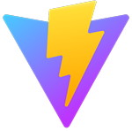

### Hello 👋

  

About me:

-   _Intrigued_ by [**automation**](https://github.com/hmerritt/fspop)
-   _Passionate_ about blazing-fast [**web applications**](https://github.com/music-library/music-library)
-   _In love_ with [**films**](https://moonshot.film)

Currently working on:

-   [**Adrift**](https://github.com/hmerritt/adrift) - A template react app with batteries included 🔋
-   [**Music Library**](https://github.com/music-library/music-library) - A fully-featured music web-app to stream music on all devices
-   [**Ambient TV**](https://github.com/hmerritt/ambient-tv) - A react-native web-app which cycles background images

 

**Languages I like to use:**

	
	
	
	
	

 

**Tools I like to use;**

	
	
	
	
	
	
	
	
	
	

 

**Libraries I like to use;**

    
    
    
    
    
    
	

